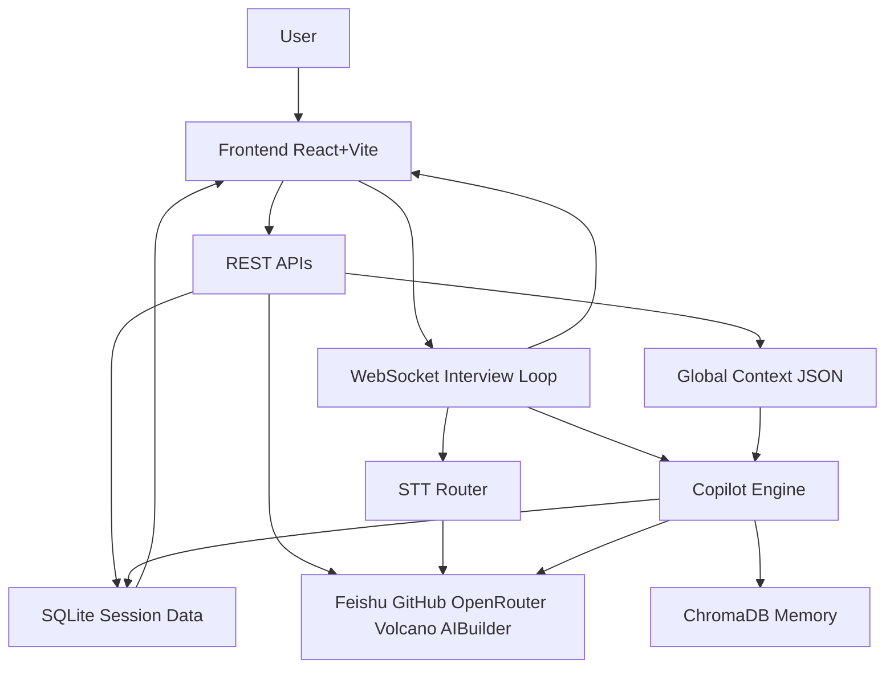

# Interview Copilot

AI-powered interview assistant for 1-on-1 candidate interviews. Provides real-time speech-to-text transcription, contextual AI suggestions, and multi-dimensional evaluation. Designed for internal hiring workflows with live transcription, context loading, and structured scorecards.

## Overview

**Purpose**: Help interviewers run structured 1-on-1 interviews with real-time transcription, AI-generated follow-up suggestions, and a weighted evaluation framework.

**When to use it**: Internal candidate interviews where you want to load company values, project background, and candidate resume upfront; record the conversation; and produce a consistent, multi-dimensional scorecard with export.

**Current scope**: Operational prototype / internal tool. Not a generic public SaaS product.

## User Workflow

1. **Create session** — From the dashboard, create a session (optionally linked to a candidate).
2. **Prepare context** — On the prep screen (`/prep/:sessionId`), import company values from Feishu, project background from GitHub or local path, and upload the candidate resume. Select LLM model. Company values and project background persist globally across sessions.
3. **Start live interview** — Click "Start Interview" to open the live screen (`/live/:sessionId`). WebSocket connects; STT provider is negotiated; opening suggestions appear from context. Record microphone audio; transcript and AI suggestions stream in real time.
4. **Evaluate** — Use the scorecard panel to score sub-dimensions. Copilot can suggest scores from transcript evidence.
5. **Review and export** — End session, review decision on `/review/:sessionId`, export transcript + scorecard as Markdown.

## Architecture



- **Frontend**: React 19 + Vite. Routes: `/` (dashboard), `/prep/:sessionId`, `/live/:sessionId`, `/review/:sessionId`. Proxies `/api` and `/ws` to backend.
- **Backend**: FastAPI. REST for sessions, context, evaluation; WebSocket for live interview (audio in, transcript + suggestions out).
- **STT**: Volcano Engine (primary, PCM streaming) or AI Builder Space (fallback, WebM). Provider chosen by config and runtime fallback.
- **LLM**: OpenRouter-compatible. Copilot generates opening questions from context and live suggestions from transcript.
- **Persistence**: SQLite for sessions/transcripts/scores; `~/.interview-copilot/global_context.json` for shared company/project context; ChromaDB for interviewer memory.

## Capability Map

| Tier | Capability | Notes |
|------|------------|-------|
| **A – User-facing** | Live transcription | Browser mic → WebSocket → STT provider |
| | AI copilot suggestions | Opening questions from context; follow-ups from transcript |
| | Context import | Feishu, GitHub/local, file upload |
| | Multi-dimensional scorecard | Technical 40%, AI Adaptability 25%, Stability 20%, Soft Skills 15% |
| | Manual transcript input | Fallback when STT fails |
| | Replay last recording | IndexedDB-backed; resend stored audio to STT |
| | Session export | Markdown transcript + scorecard |
| **B – Engineering** | FastAPI + SQLAlchemy | REST + WebSocket |
| | React + Vite + Zustand | SPA with proxy to backend |
| | Config via env | `IC_` prefix, `.env` |
| **C – Runtime** | STT provider dependency | Volcano or AI Builder; config-driven |
| | LLM provider dependency | OpenRouter-compatible |
| | ChromaDB | Optional; interviewer memory |
| | Browser microphone | Required for live transcription |

## Persistence and Context Boundaries

| Data | Storage | Scope |
|------|---------|-------|
| Sessions, candidates, transcripts, scores | SQLite (`interview_copilot.db`) | Per session |
| Company values, project background | `~/.interview-copilot/global_context.json` | Global, shared across sessions |
| Candidate profile | In-memory per session; loaded from file upload | Per session |
| Interviewer memory (questions, patterns) | ChromaDB (`~/.interview-copilot/chroma/`) | Cross-session |
| Uploaded files | `~/.interview-copilot/uploads/<session_id>/` | Per session |

## Quick Start

### Prerequisites

- Python 3.11+
- Node 18+
- Microphone (for live transcription)

### Backend

```bash
cd backend
python -m venv .venv && source .venv/bin/activate   # Windows: .venv\Scripts\activate
pip install -r requirements.txt
cp .env.example .env   # fill in API keys
uvicorn app.main:app --host 0.0.0.0 --port 8090 --reload
```

### Frontend

```bash
cd frontend
npm install
npm run dev   # starts on http://localhost:5180
```

The frontend proxies `/api` and `/ws` to `localhost:8090`.

## Configuration

All settings use the `IC_` prefix except `OPENROUTER_LLM_API_KEY`. See `backend/.env.example` for the full list.

### Required for full functionality

| Variable | Description |
|----------|-------------|
| `OPENROUTER_LLM_API_KEY` | LLM API key for copilot (OpenRouter-compatible) |
| `IC_AI_BUILDER_TOKEN` or `IC_VOLCENGINE_APP_ID` + `IC_VOLCENGINE_ASR_TOKEN` | At least one STT provider for live transcription |

### Optional integrations

| Variable | Description |
|----------|-------------|
| `IC_FEISHU_APP_ID`, `IC_FEISHU_APP_SECRET` | Import company values from Feishu docs |
| `IC_GITHUB_TOKEN` | Import project context from private GitHub repos |

### STT provider selection

- `IC_STT_PROVIDER`: `auto` (default) | `volcengine` | `ai_builder`
- With `auto`: Volcano Engine is tried first (PCM); falls back to AI Builder (WebM) if Volcano is unavailable.
- With `ai_builder`: Only AI Builder is used.
- Frontend adapts capture mode (AudioWorklet → PCM or MediaRecorder → WebM) based on backend provider status.

### Defaults

- Database: `sqlite+aiosqlite:///./interview_copilot.db`
- Data directory: `~/.interview-copilot`
- LLM: OpenRouter, `deepseek/deepseek-chat-v3-0324`

Do not commit real secrets. Use `.env` (gitignored).

## Verification

### Backend tests

```bash
cd backend
source .venv/bin/activate
pytest
```

### Manual verification checklist

1. Create a session from the dashboard.
2. On prep screen: import Feishu doc or GitHub repo; upload a candidate file.
3. Start interview: confirm STT provider status appears in the transcript header.
4. Confirm opening suggestions appear in the copilot panel (requires LLM key and context).
5. Record audio or use manual transcript input; confirm transcript and evaluation coverage update.
6. End session; on review screen, confirm export works.

## Known Limitations

- **STT**: Depends on external providers (Volcano Engine, AI Builder Space). Browser microphone and audio capture constraints apply.
- **LLM**: Responsiveness depends on OpenRouter and model availability. From China, latency may be higher.
- **Provider selection**: STT provider is config-driven and runtime fallback; not user-selectable from the UI.

## Repo Layout

```
interview-copilot/
├── backend/
│   ├── app/
│   │   ├── api/          # REST routes, WebSocket handler
│   │   ├── services/     # copilot, transcription, stt_router, global_context, memory, evaluation
│   │   ├── models/       # DB models, schemas
│   │   └── adapters/     # Feishu, GitHub, file parser
│   ├── tests/
│   └── .env.example
├── frontend/
│   ├── src/
│   │   ├── pages/        # SessionPrep, LiveInterview, PostInterview
│   │   ├── components/   # context, transcript, copilot, evaluation
│   │   ├── hooks/        # useInterview, useWebSocket, useAudioStream
│   │   ├── lib/          # replayStore (IndexedDB audio persistence)
│   │   └── stores/       # interviewStore (Zustand)
│   └── vite.config.js
└── README.md
```

## Related Docs

- [AGENTS.md](../AGENTS.md) — Monorepo rules and documentation workflow
- [docs/ai-assets/project-tooling-due-diligence.md](../docs/ai-assets/project-tooling-due-diligence.md) — Capability and tooling assessment framework
